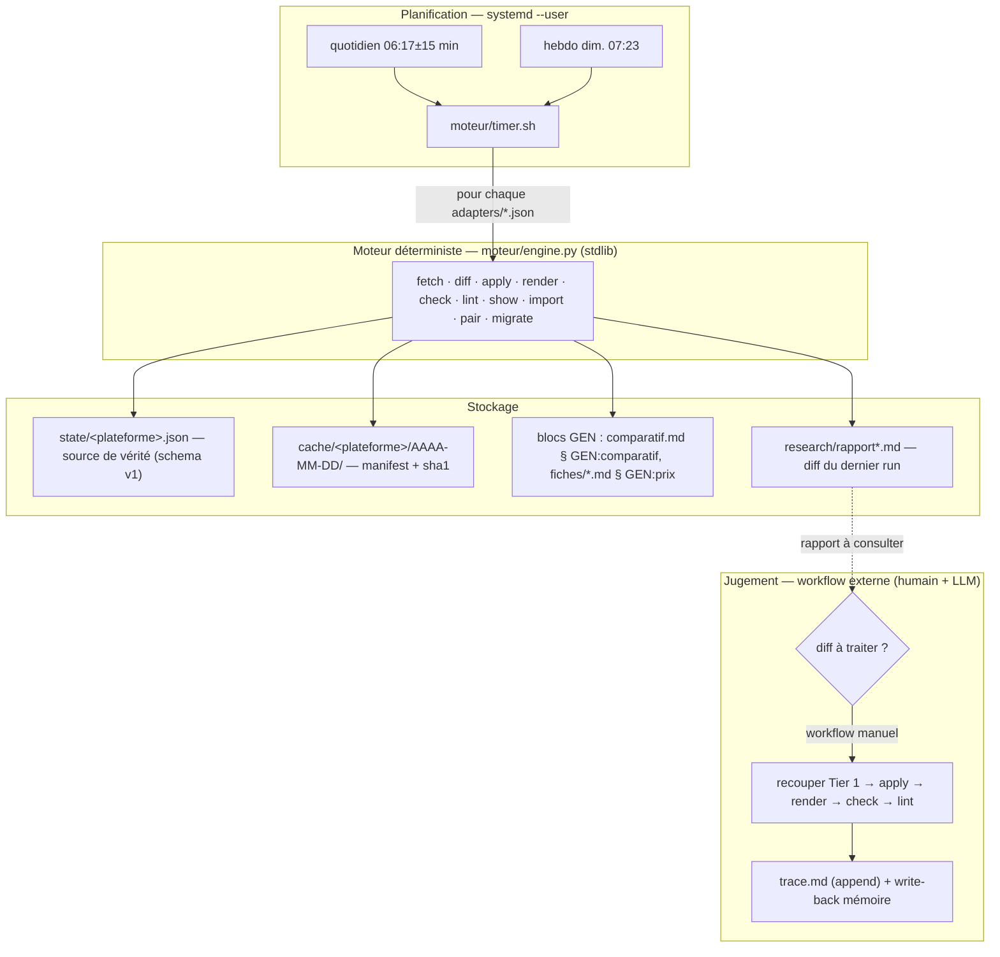
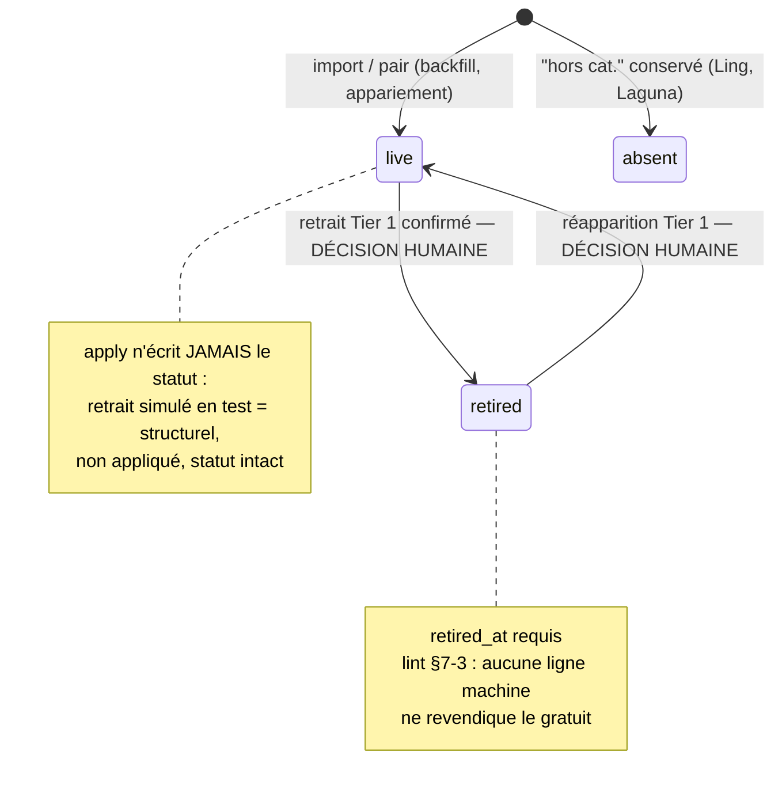
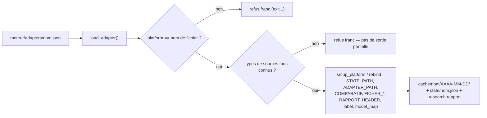

# ARCHITECTURE — moteur d'investigation

Composants, flux et contrats techniques du harnais `moteur/`. Le **quoi/le pourquoi** :
`vision.md` ; les règles et l'état courant : `moteur/ORCHESTRATOR.md` (page unique —
« tout ce qui n'est pas ici n'existe pas »).

## 1. Principes

1. **Split code / jugement** — `engine.py` (Python stdlib, **zéro dépendance**) fait tout
   le déterministe ; l'agent (LLM) recoupe, décide, annote et journalise. Jamais l'inverse :
   un LLM ne rend pas un tableau, du code ne conclut pas sur une preuve.
2. **État versionné = source de vérité** — `state/<plateforme>.json`, validé à
   chaque lecture/écriture selon le contrat `schema.json` (v1), par le validateur stdlib.
   Les markdown ne font que le rendre.
3. **Écriture machine = blocs balisés uniquement** — `<!-- GEN:*|run=AAAA-MM-JJ -->` …
   `<!-- /GEN -->` ; toute prose hors bloc est humaine (« annoter, jamais effacer »).
4. **Tier 2 = déclencheur de vérification, jamais d'écriture** — un signal d'annonce
   (RSS, docs datées) produit un « à vérifier » debout ; il n'écrit jamais l'état.
5. **Échec explicite** — health abort et `lint ÉCHEC` signalent une erreur ; exit 2 de
   `diff` signale un changement et écrit le rapport. Aucun agent ni notification n'est
   déclenché automatiquement.
6. **Une porte d'entrée CLI** — `moteur/engine.py` expose une commande `cmd_*` par phase ;
   les contrats sont regroupés par responsabilité et un adaptateur correspond à un fichier JSON.

## 2. Vue en couches



## 3. Arborescence

```
llm-compare/
├── README.md                  # entrée humaine du dépôt
├── vision.md                  # direction, non-goals, principes
├── docs/                      # documentation produit
│   └── ARCHITECTURE.md        #   ce fichier (flux/contrats)
├── research/                  # couche recherche (faits établis)
│   ├── comparatif.md          #   tableau commun (bloc machine GEN:comparatif)
│   ├── fiches/*.md            #   14 fiches (bloc machine GEN:prix + prose humaine)
│   ├── verdict.md             #   verdict argumenté
│   ├── trace.md               #   journal append-only (agent, format « Passe N »)
│   ├── rapport.md             #   rapport diff freebuff (machine)
│   ├── rapport-opencode.md    #   rapport diff opencode (machine)
│   └── … investigations, i0-francais, signaux-faibles, solar-pro-4, veille,
│        opencode-gratuit
└── moteur/                    # couche moteur (harnais)
    ├── ORCHESTRATOR.md        # page unique : contrat, état, règles
    ├── engine.py              # tout le déterministe, stdlib uniquement
    ├── schema.json            # contrat de l'état (v1)
    ├── timer.sh               # porte d'entrée unique des timers
    ├── adapters/              # freebuff.json, opencode.json → ajouter = +1 fichier
    ├── state/                 # freebuff.json, opencode.json (versionnés)
    ├── cache/                 # <plateforme>/AAAA-MM-DD/ (jour courant, réutilisé)
    ├── templates/             # fiche-llm.md (contrat de fiche)
    └── timers/                # unités systemd --user + install.sh
```

## 4. Carte de `engine.py`

| Responsabilité | Fonctions principales |
|---|---|
| Chemins, verrou et état | `path_within`, `project_path`, `atomic_write_many`, `run_locked`, `setup_platform`, `validate` |
| Tables, fiches et blocs GEN | `parse_table`, `render_table`, `render_prix_line`, `fiche_path`, `find_block`, `cmd_import`, `cmd_pair`, `cmd_migrate`, `cmd_check`, `cmd_render` |
| Contrôle documentaire | `cmd_lint` |
| Adaptateurs et appariement | `load_adapter`, `state_index`, `match_model` |
| Extraction | `ex_llms`, `ex_readme`, `ex_picker`, `ex_solar`, `ex_plans`, `ex_rss`, `ex_zen`, `ex_zcatalog`, `ex_vserved` |
| Cache et acquisition | `http_get`, `cmd_fetch`, `validate_manifest`, `load_cache` |
| Observation et comparaison | `build_observation`, `compute_changes`, `cmd_diff`, `write_rapport` |
| Application et CLI | `cmd_apply`, `main` |

## 5. Boucle quotidienne (séquence)

```mermaid
sequenceDiagram
    participant U as systemd --user
    participant T as timer.sh
    participant E as engine.py
    participant C as cache/&lt;plateforme&gt;/&lt;date&gt;/
    participant S as state/&lt;plateforme&gt;.json
    participant R as research/rapport*.md
    U->>T: quotidien 06:17±15 min
    loop pour chaque moteur/adapters/*.json
        T->>E: --platform &lt;nom&gt; fetch
        E->>C: health (200 + ancre) — sinon ABORT, aucun cache écrit
        E->>C: réutilise le cache du jour sinon télécharge (sha1)
        E-->>T: exit 0
        T->>E: --platform &lt;nom&gt; diff
        E->>C: load_cache (≥7 j sans revalidation = problème)
        E->>S: build_observation → compute_changes (4 catégories)
        E->>R: write_rapport (sauf --date)
        E-->>T: exit 0 (rien) ou 2 (changements — normal)
    end
    T->>U: 0 si tout 0|2, sinon premier code d'échec
    Note over U,R: le timer écrit le rapport; aucun agent n'est déclenché automatiquement<br/>le workflow externe peut recouper, appliquer, contrôler, tracer et écrire en mémoire
```

## 6. Modèle d'état

### 6.1 Contrat (`schema.json` v1)

```jsonc
{
  "platform": "freebuff",          // obligatoire
  "schema_version": 1,             // const 1
  "generated_at": "…ISO…",
  "imported_from": "research/comparatif.md (backfill AAAA-MM-JJ)",
  "sources": [ { "url", "tier", "fetched_at", "sha1?" } ],
  "facts": {                       // faits globaux sourcés (ex. index_version, freebucks)
    "index_version": {
      "value": "v4.3.2",
      "evidence": { "url": "https://…", "tier": 1, "at": "…ISO…" }
    }
  },
  "models": [                      // obligatoires : id, display, status, access,
    {                              // price, context, measures, history
      "id": "solar-pro-4",         // slug unique (slugify)
      "display": "Solar Pro 4",
      "status": "live",            // live | retired | absent
      "retired_at": "2026-10-06",  // requis si retired
      "access": "…", "price": {…}, "context": {…},
      "measures": { "aa": "…", "tb4": "…" },  // version = facts.index_version global
      "fiche": "research/fiches/….md",
      "history": [ … ]             // historique prix daté
    }
  ]
}
```

### 6.2 Cycle de vie d'un modèle



## 7. Cache & fraîcheur

- Emplacement : `moteur/cache/<plateforme>/AAAA-MM-DD/` — deux plateformes ne
  partagent jamais un manifest.
- `manifest.json` : plateforme + `fetched_at` global + `entries[id]` avec URL, tier, type,
  date de collecte par source, SHA-1, taille et nom du fichier. Les corps sont nommés par
  identifiant et SHA-1, limités à 25 Mio ; le manifeste est publié après les corps.
- Les invocations timer et manuelles prennent un verrou exclusif moteur pour éviter
  les écritures concurrentes dans l'état ou le cache.
- **Health d'abord** : HTTP 200 **et** ancre `must_contain` présente, sinon
  `fetch ABORT (aucun cache écrit)` — jamais de diff partiel sur une source morte.
- `fetch` réutilise un cache du jour uniquement si le corps recalcule le SHA-1 attendu ;
  `diff`, `apply` et `lint` vérifient aussi l'intégrité avant parsing.
  `fetch --revalidate` force tout.
- `diff` refuse un cache ≥ `REVALIDATE_DAYS` (7 j) → problème + message
  `fetch --revalidate` (couvert par le timer hebdo).
- `apply` refuse également toute écriture depuis un cache périmé ou invalide.

## 8. Adaptateurs & rebinding plateforme

Ajouter une plateforme = ajouter `adapters/<nom>.json`. Rien d'autre ne bouge.



- `type` = fonction extractrice dans `engine.py` : `llms_txt`, `readme_md`, `picker_ts`,
  `solar_promo_ts`, `plans_html`, `rss`, `zen_docs`, `zen_catalog`, `v1_models`, `raw`.
- `health` obligatoire ; `research` optionnel (absent → `import`/`render`/`check`/`pair`
  refusent proprement : « pas de comparatif déclaré »).
- `aliases` : noms de source non réductibles par normalisation → id d'état ;
  un modèle catalogue/lane non apparié à un état renseigné devient un problème explicite.
  Les noms inconnus dans les annonces RSS et la table des modèles dépréciés restent ignorés :
  ces sources peuvent légitimement mentionner des modèles hors périmètre.

Le chargeur valide les clés de configuration, types, tiers, URL, identifiants uniques et
chemins. Les chemins de données restent confinés au projet et à leur répertoire autorisé ;
les liens symboliques vers l'extérieur, les types d'extraction dupliqués et les clés inconnues
sont refusés.

## 9. Timers

| Unité | Quand | Entrée | Sortie |
|---|---|---|---|
| `llm-compare-quotidien.timer` | 06:17±15 min | `timer.sh quotidien` | `fetch` → `diff` par plateforme |
| `llm-compare-hebdo.timer` | dim. 07:23 | `timer.sh hebdo` | idem + `fetch --revalidate` |

- Installation : `sh moteur/timers/install.sh` (copie dans `~/.config/systemd/user/`,
  `enable --now`). Les unités du dépôt restent la source de vérité.
- Contrat `timer.sh` : **exit 2 d'un `diff` = état normal** (0|2 acceptés) ; un échec
  d'une plateforme n'empêche pas les suivantes ; le détail vit dans `research.rapport`.
- Le timer s'arrête après `fetch` et `diff` : il ne déclenche pas l'agent. Un workflow
  externe doit consulter le rapport et prendre en charge le recoupement.
- `timer.sh` : `set -eu`, boucle sur `moteur/adapters/*.json` — une nouvelle plateforme
  est automatiquement schedulée.

## 10. Droits d'écriture (ownership)

| Artefact | Écriture | Producteur |
|---|---|---|
| `state/<plateforme>.json` | bloc unique, tout le fichier | machine (`apply` — sous-ensemble sûr ; statut/retrait = humain) |
| `comparatif.md` § `GEN:comparatif` | machine | `render` |
| `fiches/*.md` § `GEN:prix` | machine | `render` (prose autour : humaine, verrouillée au contexte) |
| `research/rapport*.md` | machine (réécrit à chaque `diff`) | `write_rapport` |
| `cache/<plateforme>/<date>/` | machine | `fetch` |
| `research/trace.md` | **append-only** | agent (format « Passe N ») |
| mémoire MnemoLite | agent | write-back obligatoire après vérif web |
| `ORCHESTRATOR.md`, `docs/*`, prose fiches | humain | — |

## 11. Extension : ajouter une plateforme

1. `cp moteur/adapters/freebuff.json moteur/adapters/<nom>.json` — renseigner
   `platform` (= nom du fichier), `label`, `health`, `sources` (tiers `1|2`),
   `research` (ou `null`), `aliases`, `model_map`.
2. `python3 moteur/engine.py --platform <nom> import` (état à partir des tableaux,
   si comparatif) ou construire `state/<nom>.json` (validate/schema).
3. `… pair` (bijection état ↔ fiches) si fiches.
4. `… fetch && … diff && … apply && … render && … check && … lint`.
5. Rien à toucher dans `engine.py`, `templates/`, `timers/` (`timer.sh` boucle sur les
   adaptateurs), sauf si la plateforme a un **nouveau format de source** → ajouter une
   fonction `ex_*` + déclarer le `type`.

## 12. Décisions d'architecture (ADR résumés)

| Décision | Alternative écartée | Pourquoi |
|---|---|---|
| Python **stdlib** seul (`json`, `re`, `urllib`) | requests, pydantic, YAML | un seul fichier exécutable n'importe où ; zéro `requirements.txt` |
| **JSON** pour adaptateurs/état | YAML | parseur stdlib, pas d'alias implicites |
| Un seul `engine.py` | package de modules | KISS : lint/render/diff se partagent les mêmes regex de blocs |
| Écriture machine **bornée aux blocs GEN** | réécriture complète | prose humaine préservée, `check` = NO REGRESSION mécanique |
| Tier 2 → **verify debout**, jamais `apply` | auto-apply des annonces | évite d'écrire une fausseté (drives tiers : mimo, dépréciations docs) |
| Diff classé en **4 catégories** | binaire changed/unchanged | sépare « sûr à appliquer » / « identité rompue » / « humain » / « illisible » |
| `state` versionné dans git | dérivation permanente depuis les sources | historique, diff reproductible, `generated_at` daté |
| Cache **par jour et par plateforme** | cache unique | sha1 réutilisable, revalidation hebdo, pas de collision inter-plateformes |
